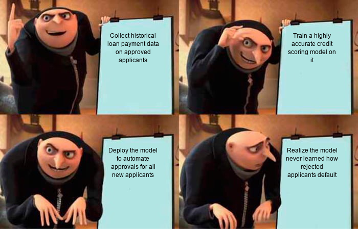

# Credit Risk Scorecard & Portfolio Analytics Platform

I developed this platform to simulate the quantitative risk infrastructure of a retail bank. The project implements an end-to-end Probability of Default (PD) scorecard, a financial policy simulator, macroeconomic stress testing modules, and SQL-based monitoring pipelines—all consolidated into an interactive dashboard.

**Live App Demo:** [Credit Risk Command Center on Streamlit Cloud](https://credit-risk-scorecard-portfolio-zunilcwekhsefzybspcwts.streamlit.app/)

---

## Why I Built This

Credit risk analytics is more than just training a binary classifier; it requires translating raw model scores into business-aligned risk bands, ensuring probability calibration for expected loss calculations, assessing portfolio stability under stress, and establishing data governance pipelines. 

To bridge this gap, I designed a system that covers:
* **The ML Pipeline**: Engineering credit-specific features, training a robust classifier, calibrating outputs to true probabilities, and evaluating feature importances.
* **The SQL Layer**: Creating an analytics mart to model historical portfolios, cohort performance, and stability indexes.
* **The Business Simulator**: Letting risk officers adjust policy cuts to instantly observe expected approval rates, captured default rates, and credit loss curves.
* **Macro Stress Testing**: Simulating credit performance under adverse scenarios (like severe delinquency or inflation shocks) to measure required capital reserves.

---

## Core System Architecture

```text
  [Source Data (UCI Client Data)] ──► [Feature Engineering Layer] ──► [HistGradientBoosting ML Model]
                                                                                │
  [Interactive Streamlit UI] ◄────── [SQLite Analytics Mart] ◄────── [Sigmoid Calibration Layer (PD)]
              │                              ▲
              ▼                              │
  [Policy Cutoff Simulator] ◄────────────────┴────────► [Macroeconomic Scenario Stress Test]
```

---

## Deep Dive into the Modules

### 1. Machine Learning & Calibration (`src/credit_risk/`)
* **Pipeline:** Utilizes `HistGradientBoostingClassifier` within a pipeline containing missing value imputation, scaling, and custom behavior-feature creation.
* **Sigmoid Calibration:** Standard tree classifiers output raw scores that do not reflect true statistical probability. I implemented a Sigmoid calibration layer (`CalibratedClassifierCV`) to map raw outputs into genuine **Probability of Default (PD)** ranges.
* **Permutation Importance:** Computed validating AUC degradation when features are randomly permuted. This exposes exactly which delinquency or utilization metrics drive the risk decisions.

### 2. SQL Analytics & Monitoring (`sql/` & `src/utils/`)
* **SQLite Database Mart:** I built an automated workflow to stage raw applicant results, feature flags, and model scores inside a structured SQLite database (`credit_risk.sqlite`).
* **KPI Cohorts:** The SQL layer features optimized monitoring queries to track:
  * Monthly portfolio risk distributions.
  * Calibration gaps across specific demographic and limit segments.
  * Population Stability Index (PSI) to flag feature drift before it affects model performance.

### 3. Policy & Stress Testing Simulator (`dashboard/`)
* **Business Cost Optimization:** Maximizing ML accuracy is rarely the goal in banking. I programmed a cost function that weights the cost of approving a defaulted borrower (charge-off) against the opportunity cost of declining a creditworthy applicant (loss of interest income).
* **Interactive Underwriting Policy:** Risk managers can slide cutoffs to find the exact cost-minimizing threshold and evaluate portfolio financial outcomes.
* **Macro Scenarios:** Users can shock the portfolio with specific macroeconomic shifts (mild, adverse, and severe payment shocks) to output capital reserve recommendations.

---

## Step-by-Step Replication Guide

If you want to run this platform locally, follow these instructions to set up the workspace, pull the dataset, train the scorecard, compile the SQL mart, and launch the dashboard.

### 1. Clone and Install Dependencies
Initialize a clean Python environment and install the package and its requirements:
```bash
git clone https://github.com/madhusudan00018-del/credit-risk-scorecard-portfolio.git
cd credit-risk-scorecard-portfolio

# Initialize and activate virtual environment
python -m venv .venv
source .venv/bin/activate  # On Windows: .venv\Scripts\activate

# Install package in editable mode with dependencies
pip install -r requirements.txt
pip install -e .
```

### 2. Fetch the UCI Credit Dataset
Pull the source Credit Card Default dataset using the automated download utility:
```bash
python src/utils/download_data.py
```
*This downloads the raw CSV files into `data/raw/`.*

### 3. Train the Model Pipeline
Run the preprocessing, feature engineering, and model training script:
```bash
python src/utils/run_pipeline.py --config config/model_config.yaml
```
*This executes a full train-test split, serializes the calibrated model to `models/pd_model.joblib`, and outputs processing logs.*

### 4. Build the SQL Analytics Database
Compile the database schemas and run the analytical SQL views:
```bash
python src/utils/build_sqlite_mart.py
```
*This creates the database `data/processed/credit_risk.sqlite` and populates the KPI tables.*

### 5. Launch the Local Dashboard
Run the Streamlit application:
```bash
streamlit run app.py
```
*The app will automatically spin up on local port 8501.*

### 6. Run the Test Harness
Execute the pytest suite to verify script imports and mathematical functions:
```bash
pytest
```

---

## Technologies Used

* **Language:** Python
* **ML Infrastructure:** Scikit-learn, Joblib
* **Data & Analytics:** Pandas, NumPy, SQLite, SQL
* **User Interface:** Streamlit, Plotly Express
* **Environment & Quality:** VS Code Dev Containers, Pytest, Ruff

---

## Credit Risk Humor & Analytics Insights

To demonstrate the real-world operational challenges of credit modeling in an interactive and lighthearted way, here are some classic industry memes representing the core themes of this project:

### 1. Reject Inference & Selection Bias (Gru's Plan)
This illustrates the selection bias challenge—training a scorecard only on approved candidates means the model never learns how rejected candidates actually default.


### 2. Underwriting Automation vs. Reality (Anakin & Padme)
A look at the risk officer's concern when implementing fully automated instant credit decisioning.


### 3. Feature Selection & Alternate Data (Distracted Boyfriend)
A funny look at fintech startups chasing social media and unstructured sentiment features rather than relying on monotonic, stable, and highly explainable CIBIL scores.


---

## Author & Contact

This project was built entirely from scratch to demonstrate production-level credit risk modeling and portfolio engineering.

* **Developer:** Madhusudan Yadav
* **Email:** madhusudan00018@gmail.com
* **GitHub:** [madhusudan00018-del](https://github.com/madhusudan00018-del)
* **LinkedIn:** [Madhusudan Yadav](https://www.linkedin.com/in/madhusudan-yadav-0b1652194/)
